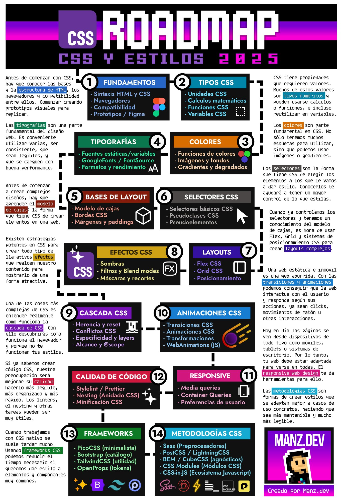

# CSS ROADMAP

Este roadmap de CSS está diseñado para guiarte a través del aprendizaje de CSS de una manera ordenada y estructurada. CSS (Cascading Style Sheets) es un lenguaje de diseño utilizado para describir la presentación de un documento escrito en HTML o XML. Con CSS, puedes controlar el diseño visual de tu sitio web, incluyendo colores, fuentes, espaciado, y disposición de los elementos.

A lo largo de este roadmap, exploraremos los fundamentos de CSS, las diferentes unidades y cálculos matemáticos que puedes utilizar, cómo trabajar con colores y tipografía, y las bases del layout. Este roadmap está basado en la imagen y trabajo de [Manz](https://manz.dev/) y está diseñado para ayudarte a convertirte en un experto en CSS.

¡Empecemos este viaje de aprendizaje juntos!



## Fundamentos

Antes de comenzar con CSS, hay que conocer las bases y la estructura de HTML, los navegadores y la compatibilidad entre ellos. Comenzar creando prototipos visuales para replicar.

### Sintaxis

#### HTML (HyperText Markup Language)

HTML es el lenguaje para estructurar el contenido de una página web. Usa etiquetas que se abren y cierran. Ejemplo básico:


```html
<!DOCTYPE html>
<html>
<head>
    <title>Mi página</title>
</head>
<body>
    <h1>Título principal</h1>
    <p>Este es un párrafo.</p>
    <a href="https://example.com">Enlace</a>
</body>
</html>
```

- Etiquetas: `<h1>`, `<p>`, `<a>` (abiertas) y `</h1>`, `</p>`, `</a>` (cerradas).
- Atributos: Añaden información extra, como href en los enlaces.

#### CSS (Cascading Style Sheets)

CSS estiliza el contenido estructurado con HTML. Se define en un archivo .css o dentro de `<style>`.

```css
body {
    background-color: lightblue;
    font-family: Arial, sans-serif;
}

h1 {
    color: darkblue;
    text-align: center;
}

p {
    font-size: 16px;
    line-height: 1.5;
}
```

  - Selectores: Como body, h1, p (para aplicar estilos a esos elementos).
  - Propiedades: Como color, font-size, background-color (definen los estilos).
  - Valores: Lo que asignas a las propiedades, como darkblue o 16px.
  
### Navegadores


### Compatabilidad

### Prototipos / Figma

## Tipos

CSS tiene propiedades que requieren valores. Muchos de estos valores son tipos numéricos y pueden usarse cálculos o funciones, e incluso reutilizar en variables.

### Unidades

### Calculos Matemáticos

### Funciones

### Variables

## Colores

Los colores son parte fundamental en CSS. No solo tenemos muchso esquemas para utilizar, sino que podemos usar imagenes y gradientes.

### Funciones de colores

### Imagenes y fondos

### Gradientes y degradados

## Tipografía

Las tipografias son una parte fundamental del diseño web. Es conveniente utilizar varias, ser consciente, que sean legibles, y quese carguen con buena performance.

### Fuentes estaticas / variables

### google fonts / font source

### Formatos y rendimiento

## Base de layout


### Modelo de cajas

### Bordes

### Margenes y paddings

## Selectores

### Selectores basicos

### Pseudoclases

### Pseudoelementos

## Efectos

### Sombras

### Filtros y Blend modes

### Mascaras y recortes

## Layout

### Flex

### Grid

### Posicionamiento

## Cascada

### Herencia y reset

### Conflictos

### Especificidad y layers

### Alcance y scope

## Animaciones

### Transiciones

### Animaciones

### Transformaciones

### WebAnimations API

## Responsive

### Media queries

### Container queries

### Preferencias de usuario

## Calidad de código

### Styleint / prettier

### Nesting 

### Minificación

## Frameworks

### PicoCSS (minimalista)

### Bootstrap (catalogo)

### Tailwind (utilidad)

### OpenProps (tokens)

## Metodologías

### Sass

### PostCSS

### BEM

### CSS Modules

### Css-in-JS
